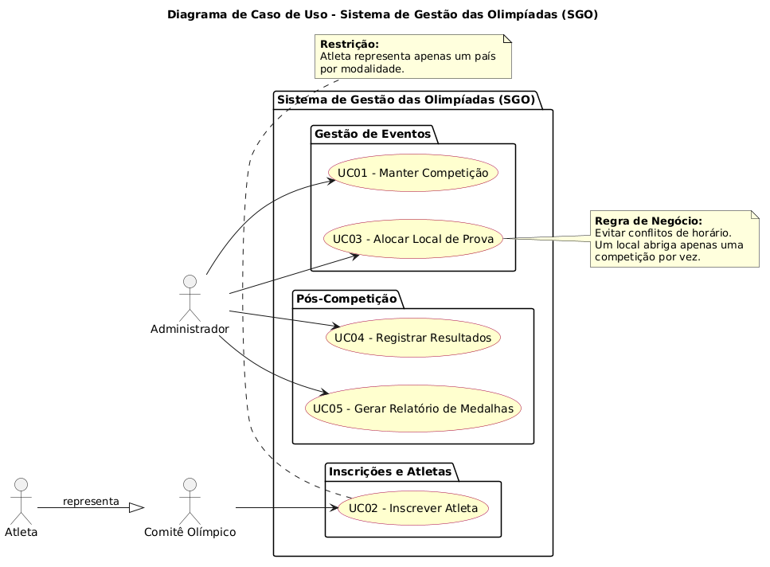
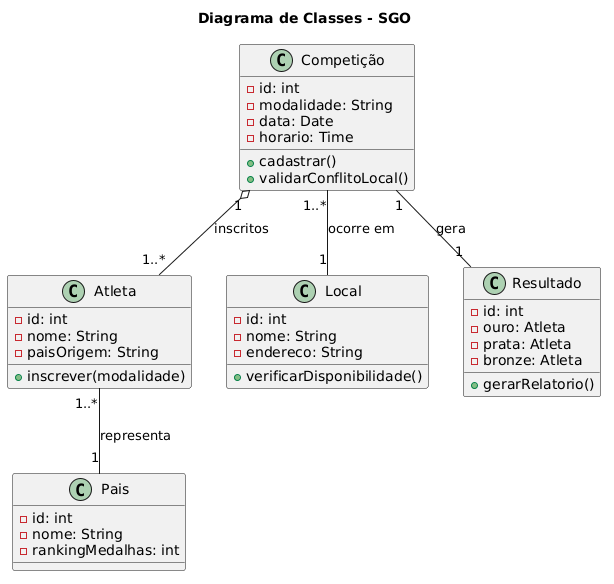
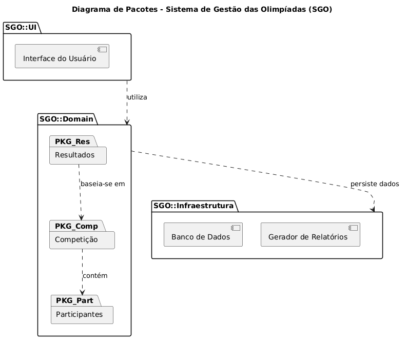
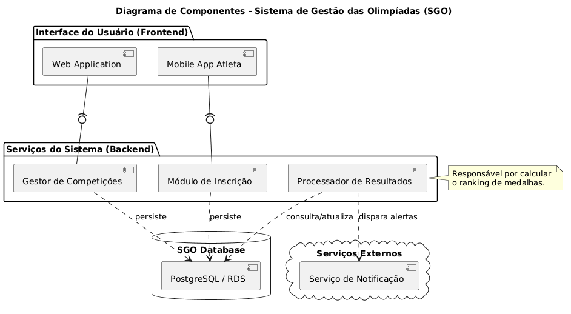
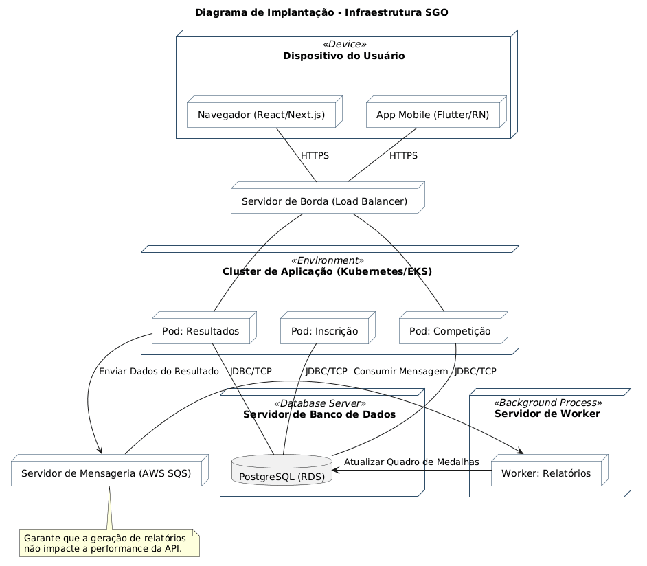

# Sistema de Gestão das Olimpíadas (SGO)

Este repositório contém a modelagem completa do **SGO (Sistema de Gestão das Olimpíadas)**, desenvolvido como parte da disciplina de **Projeto de Software** do 4º período de Engenharia de Software na PUC Minas.

O sistema visa coordenar competições, inscrições de atletas, alocação de locais e controle de resultados para os jogos olímpicos.

## 📝 Histórias de Usuário (User Stories)

| ID   | Título | Descrição |
|:---  |:--- |:--- |
| **US01** | Cadastro de Competição | Como administrador, quero cadastrar modalidades, datas e horários para organizar o cronograma olímpico. |
| **US02** | Inscrição de Atletas | Como comitê nacional, quero inscrever atletas em modalidades específicas, garantindo que representem apenas um país por categoria. |
| **US03** | Alocação de Locais | Como organizador, quero alocar locais para as provas garantindo que não haja conflitos de horário em uma mesma arena. |
| **US04** | Registro de Resultados | Como juiz da prova, quero registrar os tempos/pontuações e definir os medalhistas de ouro, prata e bronze. |
| **US05** | Quadro de Medalhas | Como espectador ou jornalista, quero visualizar o ranking de medalhas atualizado por país. |

---

## 📊 Diagramas de Modelagem

### 1. Diagrama de Casos de Uso
Descreve as funcionalidades do sistema e como os atores interagem com elas.

### 2. Diagrama de Classes
Define a estrutura lógica do sistema, atributos e os relacionamentos entre as entidades.

### 3. Diagrama de Pacotes
Organiza o sistema em módulos lógicos (Domínio, Infraestrutura, Interface).

### 4. Diagrama de Componentes
Ilustra a organização e as dependências entre os componentes de software.

### 5. Diagrama de Implantação
Representa a arquitetura física do sistema e o hardware onde o software será executado.

---

## 🛠️ Tecnologias Utilizadas
- **PlantUML**: Para geração dos diagramas via código.
- **Markdown**: Para documentação do repositório.
- **GitHub**: Para controle de versão e hospedagem.

## 👨‍💻 Autor
- **Bernardo** - [(https://github.com/BernardoLevyy)]
